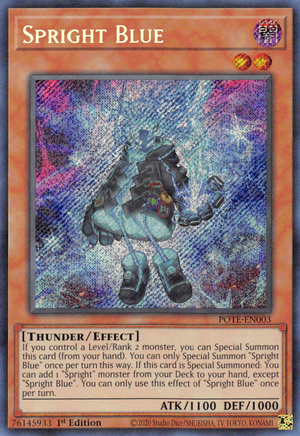

# Spright Blue Bot - Discord🤖

    Bot criado em Python no estilo do monstro de duelo (Yu-Gi-Oh!) 'Spright Blue'. Não é um monstro forte, mas eu tenho certo carinho.

    O Bot foi desenvolvido para ajudar na manutenção do seu servidor e chamadas de voz, alegrando seu ambiente.

    

#

> **Bibliotecas utilizadas**
* `import discord`
    * `pip install discord.py`
    * `from discord.ext import commands`